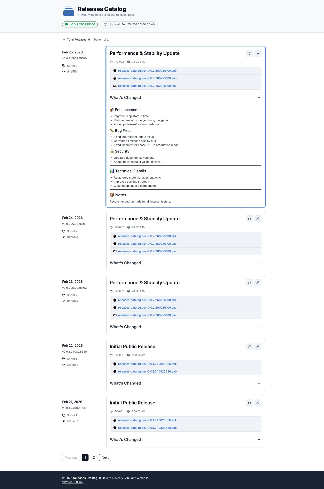

# 📦 Releases Catalog

[](https://github.com/lbngoc/releases-catalog)
[](LICENSE)
[](https://github.com/lbngoc/releases-catalog/actions)
[](https://www.11ty.dev/)
[](https://vitejs.dev/)
[](https://tailwindcss.com/)
[](https://alpinejs.dev/)

> A lightweight static release catalog for browsing versioned builds, changelogs, and downloadable artifacts.

Built with **Eleventy**, **Vite**, **Alpine.js**, and **Tailwind CSS**.

---

## 🖼 Screenshot



Example preview layout:

- Paginated release list
- Expandable changelog sections
- Deep-link highlighting
- Asset download links

---

## ✨ Overview

Releases Catalog is a static web application designed to:

- List application releases from a CSV file
- Dynamically load and render versioned changelogs
- Provide downloadable build artifacts
- Support deep-linking to specific releases
- Work entirely without a backend

Perfect for:

- Internal QA build portals
- Client distribution pages
- Open-source release hubs
- Mobile APK / IPA distribution pages

---

## 🚀 Features

- 📄 Release metadata from `catalog.csv`
- 📝 On-demand loading of `CHANGELOG.md`
- 🔗 Deep linking via `#v=version.id`
- 🎯 Unique version identifiers (`versionCode`)
- 💾 Session-based changelog caching
- 🔄 Per-release refresh (clear cache & reload)
- 📱 Fully responsive layout
- ⚡ Client-side pagination
- 🧩 Configurable via `window.catalogConfig`
- 🧱 No backend required

---

## 🛠 Tech Stack

- [Eleventy](https://www.11ty.dev/) – Static Site Generator
- [Nunjucks](https://mozilla.github.io/nunjucks/) – Templates
- [Vite](https://vitejs.dev/) – Bundler
- [Alpine.js](https://alpinejs.dev/) – Client interactivity
- [Tailwind CSS](https://tailwindcss.com/) – Styling

---

## 📂 Project Structure

```

src/
├── _includes/        # Layouts & Nunjucks partials
├── assets/
│   ├── main.js       # Vite entry
│   ├── main.css      # Tailwind styles
│   └── svg/          # Icons
├── catalog/          # Alpine app logic
│   ├── app.js
│   ├── config.js
│   ├── services.js
│   └── utils.js
├── releases/         # Version folders (CHANGELOG + artifacts)
├── catalog.csv       # Release metadata (id, version, datetime)
├── index.njk         # Entry template
└── favicon.svg

_site/                # Generated output

````

---

## 📄 Release Data Format

### `catalog.csv`

```csv
#id,version,datetime
240823526,0.0.1,2024-08-23T10:00:00
260225100,0.0.2,2025-02-26T10:00:00
````

Each row generates a unique:

```
versionCode = `${version}.${id}`
```

Example:

```
0.0.2.260225100
```

This ensures:

* Unique deep-linking
* Stable cache keys
* No collision if versions repeat

---

## 📁 Release Folder Structure

Each release folder must match the `version` field:

```
releases/
└── 0.0.2/
    ├── CHANGELOG.md
    └── my-app-0.0.2.apk
```

The folder name must equal `version`.

---

## 🔗 Deep Linking

You can link directly to a specific release:

```
https://example.com/#v=0.0.2.260225100
```

Behavior:

* Automatically navigates to correct page
* Scrolls to release
* Highlights the release
* Expands changelog section

---

## ⚙ Configuration Override

You can override behavior globally:

```html
<script>
window.catalogConfig = {
  pageSize: 10,
  catalogCsv: '/catalog.csv',
  changelogFolder: '/releases',
  changelogFile: 'CHANGELOG.md',

  getAssetIconUrl(asset) {
    return '/assets/svg/custom.svg';
  },

  getAssetDownloadUrl(version, asset) {
    return `/releases/${version}/${asset}`;
  },

  getAssetDownloadName(version, asset) {
    return asset;
  }
};
</script>
```

---

## 🧪 Development

Install dependencies:

```bash
npm install
```

Run development:

```bash
npm run dev
```

Build production:

```bash
npm run build
```

Output directory:

```
_site/
```

---

## 📦 Deployment

Because this is a fully static site, it can be deployed to:

* GitHub Pages
* Netlify
* Vercel
* Cloudflare Pages
* Any static hosting provider

No server required.

---

## 🧠 How It Works

1. `catalog.csv` provides release metadata.
2. Releases are paginated client-side.
3. CHANGELOG files are fetched on demand.
4. Markdown is parsed and rendered dynamically.
5. Results are cached in `sessionStorage`.
6. UI state is controlled via hash (`#v=`).

---

## 🤝 Contributing

Pull requests are welcome.

If you plan major changes, please open an issue first to discuss what you would like to change.

---

## 📜 License

MIT