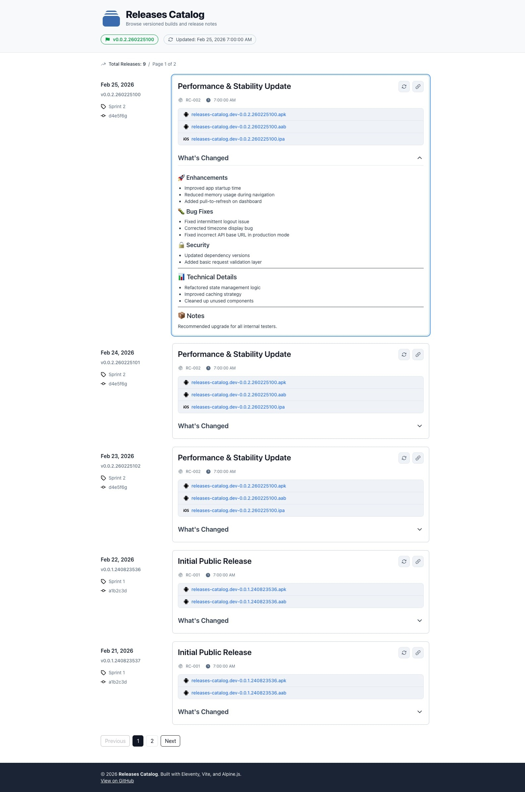

# 📦 Releases Catalog

[](https://lbngoc.github.io/releases-catalog/)
[](https://github.com/lbngoc/releases-catalog)
[](LICENSE)
[](https://github.com/lbngoc/releases-catalog/actions)

[](https://www.11ty.dev/)
[](https://vitejs.dev/)
[](https://tailwindcss.com/)
[](https://alpinejs.dev/)

> A lightweight static release catalog for browsing versioned builds, changelogs, and downloadable artifacts.

Built with **Eleventy**, **Vite**, **Alpine.js**, and **Tailwind CSS**.

---

## 🖼 Screenshot



---

## ✨ Overview

Releases Catalog is a static web application designed to:

- List application releases from a CSV file
- Dynamically load and render versioned changelogs
- Provide downloadable build artifacts
- Support deep-linking to specific releases
- Work entirely without a backend

Perfect for:

- Internal QA build portals
- Client distribution pages
- Open-source release hubs
- Mobile APK / IPA distribution pages

---

## 🚀 Features

- 📄 Release metadata from `catalog.csv`
- 📝 On-demand loading of `CHANGELOG.md`
- 🔗 Deep linking via `#v=version.id`
- 🎯 Unique version identifiers (`versionCode`)
- 💾 Session-based changelog caching
- 🔄 Per-release refresh (clear cache & reload)
- 🌗 Dark mode with system preference detection and manual toggle
- 📱 Fully responsive layout
- ⚡ Client-side pagination
- 🧩 Configurable via `window.catalogConfig`
- 🏗 Relative paths — works in any subdirectory without config
- 🧱 No backend required

---

## 🛠 Tech Stack

- [Eleventy](https://www.11ty.dev/) – Static Site Generator
- [Nunjucks](https://mozilla.github.io/nunjucks/) – Templates
- [Vite](https://vitejs.dev/) – Bundler
- [Alpine.js](https://alpinejs.dev/) – Client interactivity
- [Tailwind CSS](https://tailwindcss.com/) – Styling

---

## 📂 Project Structure

```text
src/
├── _includes/        # Layouts & Nunjucks partials
├── assets/
│   ├── main.js       # Vite entry
│   ├── main.css      # Tailwind styles
│   └── svg/          # Icons
├── catalog/          # Alpine app logic
│   ├── app.js
│   ├── config.js
│   ├── services.js
│   └── utils.js
├── releases/         # Version folders (CHANGELOG + artifacts)
├── catalog.csv       # Release metadata (id, version, datetime)
├── index.njk         # Entry template
└── favicon.svg

_site/                # Generated output
```

---

## 📄 Release Data Format

### `catalog.csv`

```csv
#id,version,datetime
240823526,0.0.1,2024-08-23T10:00:00
260225100,0.0.2,2025-02-26T10:00:00
```

Each row generates a unique `versionCode`:

```js
versionCode = `${version}.${id}`
// e.g. 0.0.2.260225100
```

This ensures unique deep-linking, stable cache keys, and no collision if versions repeat.

---

## 📁 Release Folder Structure

Each release folder must match the `version` field:

```text
releases/
└── 0.0.2/
    ├── CHANGELOG.md
    └── my-app-0.0.2.apk
```

---

## 🔗 Deep Linking

Link directly to a specific release:

```text
https://example.com/#v=0.0.2.260225100
```

Behavior:

- Automatically navigates to the correct page
- Scrolls to and highlights the release
- Expands the changelog section

When no hash is present, the latest release is automatically expanded without modifying the URL.

---

## 🌗 Dark Mode

Dark mode is supported with:

- **System preference detection** — follows `prefers-color-scheme` on first visit
- **Manual toggle** — sun/moon button in the header
- **Persistent preference** — stored in `localStorage`
- **No flash** — inline script applies the class before CSS loads

---

## 🏗 Subdirectory Deployment

All asset and data paths in the app use **relative URLs** (no leading `/`), so the site works out of the box when deployed under any subdirectory (e.g. `https://example.com/myapp/`) — no configuration or post-build edits needed.

> Keep paths in `config.js` relative (`catalog.csv`, `releases/...`, `assets/svg/...`) to preserve this behavior. Absolute paths (starting with `/`) will bypass the subdirectory and break.

---

## ⚙ Configuration Override

Customize behavior by defining `window.catalogConfig` before the app loads. All methods have access to `this` (the merged config object), so `this.releasesRelativePath` and other properties are available inside any overridden function.

### Configuration Options

| Option | Type | Default | Description |
| --- | --- | --- | --- |
| `pageSize` | `number` | `5` | Releases per page |
| `catalogCsv` | `string` | `"catalog.csv"` | Path or URL to catalog CSV file |
| `releasesRelativePath` | `string` | `"releases"` | Base path/URL used by URL builder functions |
| `getAssetIconUrl(asset)` | `function` | — | Icon URL for a given asset filename |
| `getAssetDownloadUrl(version, asset)` | `function` | — | Download URL for an artifact |
| `getAssetDownloadName(version, asset)` | `function` | — | Filename hint for download |
| `getChangelogUrl(versionCode)` | `function` | — | URL for `CHANGELOG.md` |
| `transformChangelogHtml(html)` | `function` | — | Post-process rendered changelog HTML |

---

### Same-host (relative paths)

Files are served alongside the static site. Relative paths are resolved by the browser from the current page URL, so subdirectory deployments work automatically without any config change.

> Do **not** use a leading `/` — absolute paths ignore the deployment subdirectory and will break.

```html
<script>
window.catalogConfig = {
  pageSize: 10,
  catalogCsv: "catalog.csv",        // relative to page URL
  releasesRelativePath: "releases",  // relative to page URL

  getAssetDownloadName(version, asset) {
    return `myapp-${version}.apk`;
  },

  transformChangelogHtml(html) {
    return html.replace(
      /\b([A-Z]+-\d+)\b/g,
      (match) => `<a href="https://your-jira/browse/${match}" target="_blank">${match}</a>`
    );
  }
};
</script>
```

---

### CDN / External Storage

Full URLs (`https://...`) are used as-is by the browser. Setting `catalogCsv` and `releasesRelativePath` to full URLs is enough; the URL builder functions (`getAssetDownloadUrl`, `getChangelogUrl`) use `this.releasesRelativePath` automatically and require no override.

```html
<script>
window.catalogConfig = {
  catalogCsv: "https://cdn.example.com/my-app/catalog.csv",
  releasesRelativePath: "https://cdn.example.com/my-app/releases",
};
</script>
```

> **CORS:** The CDN must allow cross-origin requests (`Access-Control-Allow-Origin`) since `catalog.csv` and `CHANGELOG.md` are loaded via `fetch()`.
>
> **Download:** The HTML `download` attribute only works for same-origin URLs. For cross-origin assets, configure the CDN to send `Content-Disposition: attachment` to force a file download.

---

## 🧪 Development

```bash
npm install
npm run dev
```

## 🏗 Build

```bash
npm run build
# Output: _site/
```

---

## 📦 Deployment

Static output in `_site/` — deploy to any static host:

- GitHub Pages
- Netlify / Vercel / Cloudflare Pages
- Any static hosting provider

No server required.

---

## 🧠 How It Works

1. `catalog.csv` provides release metadata.
2. Releases are paginated client-side.
3. CHANGELOG files are fetched on demand and cached in `sessionStorage`.
4. Markdown is parsed and rendered dynamically.
5. UI state (active release, page) is driven by the URL hash (`#v=`).
6. Dark mode state is managed via `localStorage` and a class on `<html>`.

---

## 🤝 Contributing

Pull requests are welcome. For major changes, please open an issue first.
